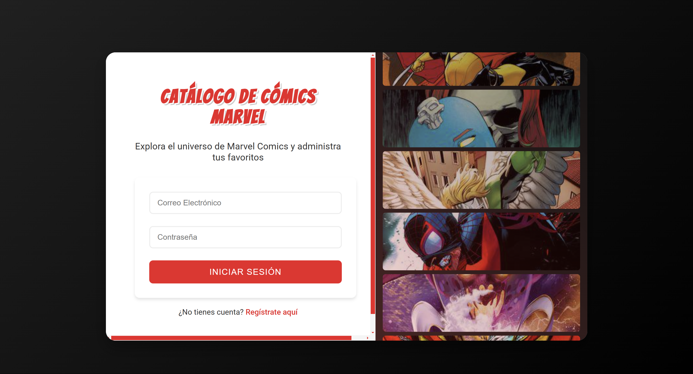

# Marvel Comics

Este proyecto es una aplicación web que permite a los usuarios explorar y administrar sus cómics favoritos de Marvel. Los usuarios pueden registrarse, iniciar sesión, ver un catálogo de cómics, agregar cómics a sus favoritos y eliminarlos de sus favoritos.

## Características

- Registro e inicio de sesión de usuarios.
- Visualización de un catálogo de cómics de Marvel.
- Visualización de los detalles del cómic al dar clic.
- Agregar y eliminar cómics de la lista de favoritos.

## Requisitos

- Docker

## Instalación

### Clonar el repositorio

```sh
git clone https://github.com/cesar310/marvel-comics.git
cd marvel-comics
```

### Configurar Variables de Entorno

Crear archivo con el nombre `.env` en la raíz con el siguiente contenido:

```env
SECRET_KEY=your_secret_key
DATABASE_URL=sqlite:///marvel.db
MARVEL_API_KEY=your_marvel_public_key
MARVEL_PRIVATE_KEY=your_marvel_private_key
```

#### API Marvel
1. Registrarse en [Marvel Developer Portal](https://developer.marvel.com/)
2. Obtener API Keys
3. Actualizar `.env` en los campos `your_marvel_public_key` y `your_marvel_private_key`. Por ejemplo, si se tiene una public_key = 123 y una private_key = abc
   ```env
    SECRET_KEY=your_secret_key
    DATABASE_URL=sqlite:///marvel.db
    MARVEL_API_KEY=123
    MARVEL_PRIVATE_KEY=abc
    ```

### Construir y ejecutar la imagen de Docker

#### Usando Docker

1. Construir la imagen de Docker:

    ```sh
    docker build -t marvel_comics .
    ```

2. Ejecutar el contenedor de Docker:

    ```sh
    docker run --env-file .env -p 5000:5000 marvel_comics
    ```

### Acceder a la aplicación

Abre tu navegador web y navega a `http://localhost:5000` para acceder a la aplicación. Se deberá observar la siguiente página de inicio de sesión, si no observa las imágenes de la derecha revise la configuración del archivo `.env` ya que es un error con las API Keys, en caso de este error se necesita volver a construir la imagen de docker y ejecutar el contenedor.


